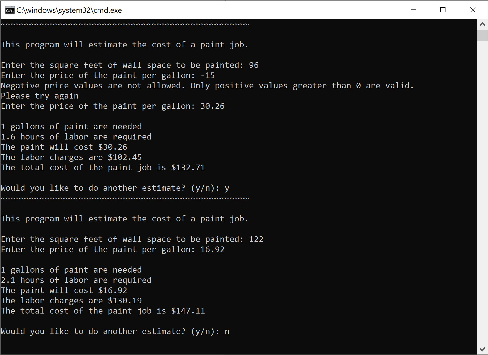

[Home](README.md) | [Beginner Python Turtle Graphics](Turtle.md) | [Recursive Python Turtle Graphics](Recursive.md) | [SVG Graphics](SVG.md) | [Paint Job Estimator](Paint.md)

## Paint Job Estimator

#### Overview

In this assignment, I needed to write a program that could [estimate the cost of a paint job](https://paintingleads.com/how-to-bid-a-paint-job-a-free-guide-to-estimating/) based on information provided by the user. With this challenge, I already had some prior experience from doing the Object Position Calculator challenge previously in the semester. There are a lot of similarities between the two programs, so completing this one was not very difficult. I needed to do the math for the prices, sizes, and labor, but after that, I was just asking questions and printing the information. Overall, I enjoyed this project and was proud once I finished it.


What the assignment required:

- The number of gallons of paint required **rounded up to whole gallons**.
- The hours of labor required.
- The cost of the paint based on the **rounded up whole gallons**.
- The labor charges.
- The total cost of the paint job.


#### Programming Project

The INFOTC 1040 Paint Job Estimator challenge states: A painting company has determined that for every 350 square feet of wall space, one gallon of paint and six hours of labor are required. The company charges $62.25 per hour for labor. Write a program called *paintjobestimator.py* that **asks the user to enter the square feet of wall space to be painted and the price of the paint per gallon**. At the end of one estimate the user it to be asked if they would like to perform another estimate. Use the prompt: *Would you like to do another estimate? (y/n)* If the user answers *y*, then the program is to accept input for another estimate. If the user answers with anything other than *y*, the program is to exit.


Below is a screenshot of the program in action.




This is the code for the program:


```python
import math

begin = True

while begin:
    print("~~~~~~~~~~~~~~~~~~~~~~~~~~~~~~~~~~~~~~~~~~~~~~~~~~~\n")
    print("This program will estimate the cost of a paint job.\n")
    
    while True:
        try:
            sqFeet = float(input("Enter the square feet of wall space to be painted: " ))
            if (sqFeet <= 0):
                print("Negative square feet values are not allowed. Only positive values greater than 0 are valid.")
                print("Please try again.")
                continue
        except ValueError:
            print("The value you entered is invalid. Only numbers are valid.")
            print("Please try again.")
        else:
            break
    
    while True:
        try:
            pricePerGallon = float(input("Enter the price of the paint per gallon: " ))
            if (pricePerGallon <= 0):
                print("Negative price values are not allowed. Only positive values greater than 0 are valid.")
                print("Please try again")
                continue
        except ValueError:
            print("The value you entered is invalid. Only numbers are valid.")
            print("Please try again.")
        else:
            break

    rounded = math.ceil(sqFeet / 350)
    
    hours = sqFeet/350 *6

    paintCost = rounded*pricePerGallon

    laborCost = float(hours*62.25)

    totalCost = paintCost+laborCost
    print("\n{}".format(rounded), "gallons of paint are needed")
    print("{0:.1f}".format(hours), "hours of labor are required")
    print("The paint will cost ${0:.2f}".format(paintCost))
    print("The labor charges are ${0:.2f}".format(laborCost))
    print("The total cost of the paint job is ${0:.2f}".format(totalCost))

    restart = input("\nWould you like to do another estimate? (y/n): ")
    if restart != "y":
        begin = False

```


*This website was created in Markdown for Garrett High's Introduction to Information Technology class as a final project in the 2020 Fall Semester*