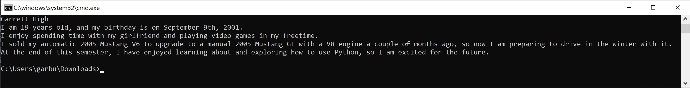

[Home](https://google.com) | [Beginner Python Turtle Graphics](https://google.com) | [Recursive Python Turtle Graphics](https://google.com) | [SVG Graphics](https://google.com) | [Paint Job Estimator](https://google.com)

## Home

#### Welcome to Garrett High's Programming Website

This is my website made with Markdown for my Information Technology Final. My name is Garrett High, and I am a student taking information technology classes at the [University of Missouri](https://engineering.missouri.edu/academics/it/). So far I have only taken Information Technology and Python Programming classes, but I plan on taking more types of classes in the future. I am currently only taking two Mizzou classes because I am taking general education classes at my local community college online as well.


#### Personal Life

I have a 21 year old brother, Logan, a mom, Melanie, and a dad, Mike. At home, I also have a black lab named Chloe and three cats: Jack, Olivia, and cupcake. My girlfriend's name is Katie, and we have been dating for almost a year-and-a-half now. My best friends include Andrew, who attends Bradley University, and Keegan, who also attends the University of Missouri.


My hobbies include:

- Spending Time with My Girlfriend
- Hanging Out with My Friends
- Playing Video Games
- Working Out
- Sleeping
- Programming


#### About Me Project

The INFOTC 1000 About Me challenge states: In this programming challenge you are to create a Python program called aboutme.py. In this program you are to print four or more lines of text about you using the Python `print()` statement. The first line of text you are to print is to be your name. The other lines can be any information you want to print. The goal of this challenge is to learn how to write, test, package, and submit a first Python program.


Below is a screenshot of the program in action.




This is the code for the program:


```python
print("Garrett High")
print("I am 19 years old, and my birthday is on September 9th, 2001.")
print("I enjoy spending time with my girlfriend and playing video games in my freetime.")
print("I sold my automatic 2005 Mustang V6 to upgrade to a manual 2005 Mustang GT with a V8 engine a couple of months ago, so now I am preparing to drive in the winter with it.")
print("At the end of this semester, I have enjoyed learning about and exploring how to use Python, so I am excited for the future.")
```


*This website was created in Markdown for Garrett High's Introduction to Information Technology class as a final project in the 2020 Fall Semester*

