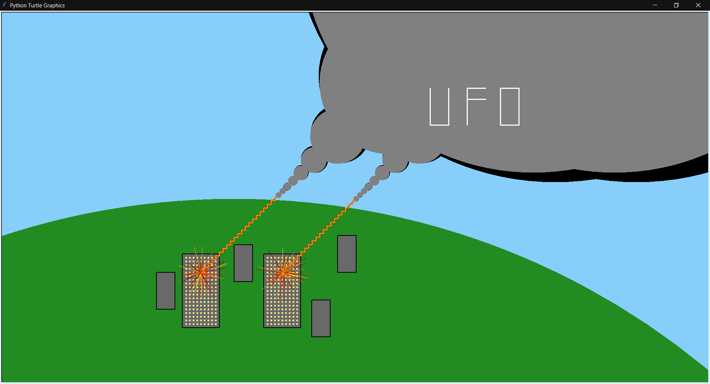

[Home](README.md) | [Beginner Python Turtle Graphics](Turtle.md) | [Recursive Python Turtle Graphics](Recursive.md) | [SVG Graphics](SVG.md) | [Paint Job Estimator](Paint.md)

## Recursive Python Turtle Graphics

#### Overview

[Recursive Turtle Graphics](https://www.codementor.io/@info658/python-recursion-fun-with-fractals-19ha74wokh) are like normal turtle graphics in python, but they create much more complex and detailed images. For this assignment, I had to create a Python Turtle Graphic of anything I wanted, but it just had to include recursion. After a lot of contemplation, I finally decided on making a UFO from the recursion that attacks a city on Earth. Once I had the idea made and the picture all planned out, it was a *blast* to write up all of the code to get it to work.


#### Recursion

Recursion with Turtle Graphics uses everything already learned with the graphics, but in a more complex way.  As stated from [Compucademy](https://compucademy.net/introduction-to-recursion/): "You can use recursion to draw your shapes. Recursion is when a function calls itself with a stopping condition. A famous example of recursion is the 'droste effect', but unlike recursion in programming there is no stopping condition. It keeps going on forever. A recursive function can draw itself"


Recursive Turtle Graphics are useful in creating:

- Fractals
- Recursive Figures
- Cool Images


#### Programming Project

The INFOTC 1040 Recursion and Python Turtle Graphics challenge states: You are to write a Python program that uses recursion and Turtle graphics to draw a picture. What picture is drawn is up to you. I urge you to write a program that generates the most amazing, awesome, cool, intriguing, and mind bending artwork you can. You are to do a screen capture of the picture that is drawn to create an image file that is included with the challenge submission. The purpose of this challenge is to provide experience working with recursion in Python. It also provides experience working with Turtle graphics in Python.


Below is a screenshot of the program in action.




This is the code for the program:


```python
from turtle import Turtle
import turtle
import random

def ufo_black1(t, x, y, radius):
    t.pencolor('black')
    t.hideturtle()
    t.penup()
    t.setx(x)
    t.sety(y)
    t.pendown()
    t.dot(radius)
    radius = radius - 5
    if (radius < 1000):
        ufo_black1(t, x + radius, y + radius, radius**1.2)

def ufo_grey1(t, x, y, radius):
    t.pencolor('grey')
    t.hideturtle()
    t.penup()
    t.setx(x)
    t.sety(y)
    t.pendown()
    t.dot(radius)
    radius = radius - 5
    if (radius < 1000):
        t.pencolor('grey')
        ufo_grey1(t, x + radius, y + radius, radius**1.199)
        
def ufo_black2(t, x, y, radius):
    t.color('black')
    t.penup()
    t.setx(x)
    t.sety(y)
    t.pendown()
    t.dot(radius)
    radius = radius - 5
    if (radius < 750):
        ufo_black1(t, x - radius -200, y + radius, radius**1.2)

def ufo_grey2(t, x, y, radius):
    t.color('grey')
    t.penup()
    t.setx(x)
    t.sety(y)
    t.pendown()
    t.dot(radius)
    radius = radius - 5
    if (radius < 750):
        t.pencolor('grey')
        ufo_grey1(t, x - radius -200, y + radius, radius**1.199)

def ufo_words(t):
    t.pencolor('white')
    t.penup()
    t.pensize(3)
    t.goto(200,300)
    t.pendown()
    t.rt(90)
    t.fd(100)
    t.lt(90)
    t.fd(50)
    t.lt(90)
    t.fd(100)
    t.penup()
    t.goto(300,200)
    t.pendown()
    t.fd(100)
    t.rt(90)
    t.fd(50)
    t.penup()
    t.goto(300,270)
    t.pendown()
    t.fd(50)
    t.penup()
    t.goto(390,300)
    t.pendown()
    t.fd(50)
    t.rt(90)
    t.fd(100)
    t.rt(90)
    t.fd(50)
    t.rt(90)
    t.fd(100)

def big_building1(t):
    t.penup()
    t.pensize(2)
    t.pencolor('black')
    t.fillcolor('dim gray')
    t.goto(-250,-150)
    t.pendown()
    t.begin_fill()
    t.rt(90)
    t.fd(100)
    t.rt(90)
    t.fd(200)
    t.rt(90)
    t.fd(100)
    t.rt(90)
    t.fd(200)
    t.end_fill()
    
def big_building2(t):
    t.penup()
    t.pensize(2)
    t.pencolor('black')
    t.fillcolor('dim gray')
    t.goto(-470,-150)
    t.pendown()
    t.begin_fill()
    t.rt(90)
    t.fd(100)
    t.rt(90)
    t.fd(200)
    t.rt(90)
    t.fd(100)
    t.rt(90)
    t.fd(200)
    t.end_fill()
    
def building1(t):
    t.penup()
    t.pensize(2)
    t.pencolor('black')
    t.fillcolor('dim gray')
    t.goto(-50,-100)
    t.pendown()
    t.begin_fill()
    t.rt(90)
    t.fd(50)
    t.rt(90)
    t.fd(100)
    t.rt(90)
    t.fd(50)
    t.rt(90)
    t.fd(100)
    t.end_fill()

def building2(t):
    t.penup()
    t.pensize(2)
    t.pencolor('black')
    t.fillcolor('dim gray')
    t.goto(-330,-125)
    t.pendown()
    t.begin_fill()
    t.rt(90)
    t.fd(50)
    t.rt(90)
    t.fd(100)
    t.rt(90)
    t.fd(50)
    t.rt(90)
    t.fd(100)
    t.end_fill()
    
def building3(t):
    t.penup()
    t.pensize(2)
    t.pencolor('black')
    t.fillcolor('dim gray')
    t.goto(-120,-275)
    t.pendown()
    t.begin_fill()
    t.rt(90)
    t.fd(50)
    t.rt(90)
    t.fd(100)
    t.rt(90)
    t.fd(50)
    t.rt(90)
    t.fd(100)
    t.end_fill()

def building4(t):
    t.penup()
    t.pensize(2)
    t.pencolor('black')
    t.fillcolor('dim gray')
    t.goto(-540,-200)
    t.pendown()
    t.begin_fill()
    t.rt(90)
    t.fd(50)
    t.rt(90)
    t.fd(100)
    t.rt(90)
    t.fd(50)
    t.rt(90)
    t.fd(100)
    t.end_fill()

def lights1(t):
    t.penup()
    t.pencolor('khaki')
    t.goto(-240,-160)
    t.pendown()
    dot_distance = 10
    width = 19
    height = 9
    t.rt(180)
    t.penup()
    for i in range(height):
        for i in range(width):
            t.dot()
            t.forward(dot_distance)
        t.bk(dot_distance*width)
        t.lt(90)
        t.fd(10)
        t.rt(90)
    
def lights2(t):
    t.penup()
    t.pencolor('khaki')
    t.goto(-460,-160)
    t.pendown()
    dot_distance = 10
    width = 19
    height = 9
    t.penup()
    for i in range(height):
        for i in range(width):
            t.dot()
            t.forward(dot_distance)
        t.bk(dot_distance*width)
        t.lt(90)
        t.fd(10)
        t.rt(90)

def earth(t):
    t.penup()
    t.goto(-330,-2000)
    t.pencolor('forest green')
    t.pendown()
    t.dot(4000)


def laser1(t):
    t.pensize(3)
    t.penup()
    t.pencolor('red')
    t.goto(-200,-200)
    t.pendown()
    t.lt(135)
    t.fd(277)
    t.lt(135)
    t.pencolor('dark orange')
    for i in range(20):
        t.fd(5)
        t.lt(90)
        t.fd(10)
        t.rt(90)
        t.fd(5)
    t.rt(135)
    
colors  = ["red","dark red","maroon","orange","dark orange","gold","firebrick"]

def explosion1(t):
    t.pensize(.5)
    t.penup()
    t.goto(-200,-200)
    t.pencolor('firebrick')
    t.pendown()
    for i in range(100):
        color = random.choice(colors)
        angle = random.randint(0,45)
        distance = random.randint(0,75)
        t.pencolor(color)
        t.rt(angle)
        t.fd(distance)
        t.bk(distance)

def laser2(t):
    t.pensize(3)
    t.penup()
    t.pencolor('red')
    t.goto(-420,-200)
    t.pendown()
    t.fd(290)
    t.lt(135)
    t.pencolor('dark orange')
    for i in range(20):
        t.fd(5)
        t.lt(90)
        t.fd(10)
        t.rt(90)
        t.fd(5)
    t.rt(135)

def explosion2(t):
    t.pensize(.5)
    t.penup()
    t.goto(-420,-200)
    t.pencolor('firebrick')
    t.pendown()
    for i in range(100):
        color = random.choice(colors)
        angle = random.randint(0,45)
        distance = random.randint(0,75)
        t.pencolor(color)
        t.rt(angle)
        t.fd(distance)
        t.bk(distance)    
    
def main():
    print('Oh no! A UFO is attacking the city!')
    t = turtle
    t.bgcolor('light sky blue')
    t.title('Big UFO')
    t.hideturtle()
    ufo = Turtle()
    ufo.speed(5000)
    ufo_black1(ufo, 0, 0, 15)
    ufo_black2(ufo, 0, 0, 15)
    ufo_grey1(ufo, 0, 0, 15)
    ufo_grey2(ufo, 0, 0, 15)
    ufo_words(ufo)
    earth(ufo)
    big_building1(ufo)
    big_building2(ufo)
    building1(ufo)
    building2(ufo)
    building3(ufo)
    building4(ufo)
    lights1(ufo)
    lights2(ufo)
    laser1(ufo)
    laser2(ufo)
    explosion1(ufo)
    explosion2(ufo)
    

main()
```


*This website was created in Markdown for Garrett High's Introduction to Information Technology class as a final project in the 2020 Fall Semester*